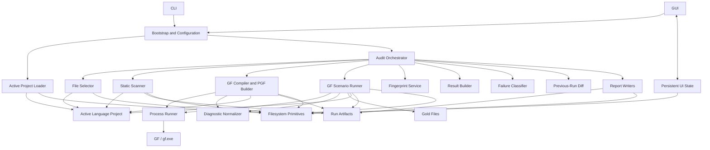

# GF Wordbench — Component Map

**Document ID:** `GF-WB-ARCH-COMPONENT-MAP`  
**Status:** Normative architecture reference  
**Applies to:** GF Wordbench framework, active project boundary, project template, validation artifacts, and external GF integration  
**Owner:** GF Wordbench maintainers  
**Target architecture:** Final GF Wordbench architecture  
**Implementation status:** Tracked outside this document  
**Last structural review:** 2026-07-22

---

## 1. Purpose

This document defines the stable components of GF Wordbench and assigns one primary responsibility to each component.

It answers:

- which components exist;
- which files own them;
- which inputs they accept;
- which outputs they produce;
- which artifacts they own;
- which components may call them;
- which dependencies are prohibited;
- where the reusable framework ends;
- where the active GF language project begins;
- when a responsibility deserves a new component;
- when logic must remain an internal helper.

This document is a map, not a duplicate contract registry.

Detailed request/response guarantees remain authoritative in:

```text
docs/INTERFILE_CONTRACT_LOCK.md
docs/EXTERNAL_TOOL_CONTRACT_LOCK.md
docs/PERSISTED_SCHEMA_LOCK.md
project/docs/INTERFILE_CONTRACT_LOCK.md
```

---

## 2. Architectural objective

GF Wordbench is a reusable Python orchestration framework around the Grammatical Framework toolchain.

It validates one active language project at a time.

The architecture must preserve these principles:

1. Python orchestrates; GF executes GF semantics.
2. CLI and GUI use the same configuration and audit services.
3. Validation stages return structured results.
4. Raw tool evidence is captured before interpretation.
5. Reports consume results and never rerun validation.
6. Persisted formats have explicit owners and versions.
7. Active-language knowledge remains under `project/`.
8. Generic templates remain under `templates/project/`.
9. Framework code remains language-neutral.
10. Every cross-file contract has one provider and known consumers.

---

## 3. System boundary

### 3.1 Inside GF Wordbench

```text
application entrypoints
configuration and project loading
audit orchestration
file discovery
static source scanning
GF compilation and PGF construction
GF scenario execution
diagnostic normalization
failure classification
result construction
run comparison
report generation
artifact manifest generation
persistent UI state
filesystem and process primitives
active project configuration
project scenarios, inputs, and gold files
project template
tests and contract checks
```

### 3.2 Outside GF Wordbench

```text
gf / gf.exe
the installed GF runtime
the Resource Grammar Library
the operating system
the process API
the filesystem
terminal and desktop environment
optional external tools explicitly contracted later
```

GF Wordbench does not own GF semantics.

GF Wordbench owns:

- command construction;
- path resolution;
- process execution policy;
- timeout policy;
- evidence capture;
- artifact verification;
- diagnostic interpretation;
- validation status;
- persistence;
- reporting.

---

## 4. High-level component flow



---

## 5. Layer model

GF Wordbench has eight architectural layers.

| Layer | Purpose | May depend on |
|---|---|---|
| 1. Presentation | CLI and GUI interaction | application services, shared models |
| 2. Configuration | defaults, active project loading, run construction, state | filesystem primitives, shared models |
| 3. Orchestration | validation planning and execution sequence | validation stages, result services, reports |
| 4. Validation stages | file selection, scan, compile, scenarios | process/filesystem primitives, models |
| 5. Interpretation | diagnostics, fingerprints, classification, diff, result building | models and pure evidence |
| 6. Reporting | persistent run artifacts and human reports | completed result models, filesystem primitives |
| 7. Infrastructure | process, path, I/O, logging | Python standard library |
| 8. Active project | language configuration, GF source, scenarios, inputs, gold | GF and project documentation |

Dependencies normally flow downward.

A lower layer must not import a higher presentation or orchestration layer.

---

## 6. Canonical component registry

| ID | Component | Canonical owner | Kind |
|---|---|---|---|
| CMP-ENTRY-CLI | Command-line interface | `app/main_cli.py` | Presentation |
| CMP-ENTRY-GUI | Desktop application entrypoint | `app/main_gui.py` | Presentation |
| CMP-GUI | GUI views and controls | `app/gui/` | Presentation |
| CMP-CONFIG-DEFAULTS | Framework defaults | `app/config.py` | Configuration |
| CMP-PROJECT | Active project loader and project lifecycle service | `app/project_config.py` | Configuration |
| CMP-BOOT | Application and run configuration builder | `app/bootstrap.py` | Configuration |
| CMP-STATE | Persistent UI state | `app/state.py` | Configuration |
| CMP-MODELS | Shared typed models | `app/models.py` | Shared boundary |
| CMP-CORE | Audit orchestrator | `app/audit/audit_core.py` | Orchestration |
| CMP-SELECT | GF file selector | `app/audit/file_selector.py` | Validation stage |
| CMP-SCAN | Static GF source scanner | `app/audit/scanner.py` | Validation stage |
| CMP-COMPILE | GF compiler and PGF builder | `app/audit/compiler.py` | Validation stage |
| CMP-SCENARIO | Native `.gfs` scenario runner | `app/audit/scenario_runner.py` | Validation stage |
| CMP-DIAG | GF diagnostic normalizer | `app/audit/diagnostics.py` | Interpretation |
| CMP-FINGERPRINT | Source fingerprint service | `app/audit/fingerprint.py` | Interpretation |
| CMP-RESULT | Result builder | `app/audit/result_model.py` | Interpretation |
| CMP-CLASSIFY | Direct/downstream failure classifier | `app/audit/classifier.py` | Interpretation |
| CMP-DIFF | Previous-run comparator | `app/audit/diff.py` | Interpretation |
| CMP-REPORT-JSON | Machine-readable summary and manifest writer | `app/reports/report_json.py` | Reporting |
| CMP-REPORT-MD | Human Markdown summary writer | `app/reports/report_md.py` | Reporting |
| CMP-REPORT-AI | AI-ready evidence packet writer | `app/reports/report_ai_ready.py` | Reporting |
| CMP-REPORT-LOGS | Aggregate and top-error log writer | `app/reports/report_logs.py` | Reporting |
| CMP-REPORT-DETAILS | Per-result detail writer | `app/reports/report_details.py` | Reporting |
| CMP-PROCESS | Generic process runner | `app/utils/process_utils.py` | Infrastructure |
| CMP-IO | Filesystem read/write primitives | `app/utils/io_utils.py` | Infrastructure |
| CMP-PATH | Portable path primitives | `app/utils/path_utils.py` | Infrastructure |
| CMP-LOGGING | Runtime logging primitives | `app/utils/logging_utils.py` | Infrastructure |
| CMP-PROJECT-CONFIG | Active language contract | `project/project.toml` | Active project |
| CMP-PROJECT-SOURCE | Active GF source tree | configured project source root | Active project |
| CMP-PROJECT-SCENARIOS | GF validation scenarios | `project/validation/scenarios/` | Active project |
| CMP-PROJECT-INPUTS | Scenario input corpus | `project/validation/inputs/` | Active project |
| CMP-PROJECT-GOLD | Reviewed expected output | `project/validation/gold/` | Active project |
| CMP-PROJECT-DOCS | Language-project specification | `project/docs/` | Active project |
| CMP-TEMPLATE | Reusable empty project | `templates/project/` | Template |
| CMP-GF | Grammatical Framework executable | external `gf` / `gf.exe` | External |

The registry identifies architectural owners.

Private helper functions and implementation classes are not separate components unless they acquire an independent contract, lifecycle, artifact, or consumer set.

---

# 7. Presentation components

## 7.1 CMP-ENTRY-CLI — Command-line interface

**Owner**

```text
app/main_cli.py
```

**Responsibilities**

- define supported command-line commands and options;
- convert textual arguments into plain Python values;
- request configuration construction from `app/bootstrap.py`;
- invoke the audit orchestrator;
- render concise terminal status;
- map final run outcomes to process exit codes;
- expose contract, schema, project, and gold maintenance commands when implemented.

**Consumes**

```text
app/bootstrap.py
app/audit/audit_core.py
app/models.py
```

**Produces**

```text
RunConfig request
terminal output
CLI exit code
```

**Must not**

- build `RunConfig` independently;
- call scanner, compiler, scenario runner, classifier, or report writers directly;
- parse GF output;
- reconstruct report paths;
- contain active-language defaults;
- persist GUI state.

---

## 7.2 CMP-ENTRY-GUI — Desktop application entrypoint

**Owner**

```text
app/main_gui.py
```

**Responsibilities**

- initialize the GUI runtime;
- construct application services;
- load safe UI state;
- open the main window;
- convert uncaught startup failures into clear user-facing errors.

**Consumes**

```text
app/bootstrap.py
app/state.py
app/gui/
```

**Must not**

- define validation semantics;
- call GF directly;
- create a separate configuration model;
- make the framework depend on the GUI toolkit for CLI execution.

---

## 7.3 CMP-GUI — GUI views and controls

**Owner**

```text
app/gui/
├── main_window.py
├── dialogs.py
├── validators.py
└── widgets.py
```

**Responsibilities**

- collect user selections;
- display preflight validation;
- launch the same audit service used by the CLI;
- display progress and completed results;
- open generated artifacts;
- save disposable UI preferences through `app/state.py`.

**Consumes**

```text
app/bootstrap.py
app/audit/audit_core.py
app/state.py
app/models.py
```

**Must not**

- duplicate audit stages;
- bypass `run_audit`;
- treat widget values as authoritative project configuration;
- parse `summary.md` to recover structured results;
- modify gold files during normal validation.

---

# 8. Configuration components

## 8.1 CMP-CONFIG-DEFAULTS — Framework defaults

**Owner**

```text
app/config.py
```

**Responsibilities**

- application name and package version;
- framework-level default timeout;
- framework-level default output behavior;
- canonical artifact filenames;
- safe default flags;
- compatibility constants;
- state filename;
- non-language-specific defaults.

**Produces**

```text
constants consumed by bootstrap, state, reports, and paths
```

**Must not contain**

- active language name;
- module suffix;
- source directory for a specific language;
- language entrypoints;
- language checkpoints;
- language-specific scan rules;
- developer-local absolute paths.

Project-specific values belong to `project/project.toml`.

---

## 8.2 CMP-PROJECT — Active project loader and lifecycle service

**Owner**

```text
app/project_config.py
```

**Responsibilities**

- locate `project/project.toml`;
- validate schema identity and version;
- parse the active project configuration;
- resolve project-relative paths;
- validate project identity;
- validate unique entrypoints, checkpoints, and scenario IDs;
- expose a typed project configuration;
- initialize `project/` from `templates/project/`;
- validate reset preconditions;
- support explicit project migration;
- keep the template language-neutral.

**Consumes**

```text
project/project.toml
templates/project/
docs/PERSISTED_SCHEMA_LOCK.md
```

**Produces**

```text
ProjectConfig
project initialization result
project validation diagnostics
```

**Must not**

- run an audit;
- invoke GF;
- silently rewrite an existing project;
- infer language identity from GUI state or old run directories;
- merge two active languages;
- use undocumented fallback paths.

The project loader is the only framework component allowed to interpret the semantic meaning of `project.toml`.

---

## 8.3 CMP-BOOT — Application and run configuration builder

**Owner**

```text
app/bootstrap.py
```

**Responsibilities**

- build immutable or effectively immutable application configuration;
- combine framework defaults, active-project configuration, and explicit user overrides;
- validate required environment paths;
- build the final `RunConfig`;
- construct deterministic GF path parts;
- validate mode-specific requirements;
- create or request run-path construction;
- perform non-executing preflight validation.

**Consumes**

```text
app/config.py
app/project_config.py
app/models.py
app/utils/path_utils.py
```

**Produces**

```text
AppConfig
ProjectConfig
RunConfig
RunPaths
```

**Precedence**

```text
explicit CLI or GUI value
→ active project value where override is permitted
→ framework default
```

Required release constraints must not be bypassed by UI state.

**Must not**

- execute validation;
- write reports;
- classify errors;
- embed GUI types;
- mutate the active project.

---

## 8.4 CMP-STATE — Persistent UI state

**Owner**

```text
app/state.py
```

**Artifact**

```text
.gf_wordbench_state.json
```

**Responsibilities**

- persist disposable UI preferences;
- remember recent local paths;
- restore safe selections;
- import documented legacy state;
- fall back safely when state is absent or malformed;
- write state atomically.

**May store**

```text
recent project root
recent RGL root
recent GF executable
recent output root
last selected validation mode
non-authoritative UI preferences
last completed run pointers
```

**Must not store**

```text
active project identity
required scenarios
entrypoints
audit results
runtime objects
running state restored as true
credentials
tokens
secrets
```

---

# 9. Shared model component

## 9.1 CMP-MODELS — Shared typed models

**Owner**

```text
app/models.py
```

**Responsibilities**

Define stable boundary models, including the final equivalents of:

```text
AppConfig
ProjectConfig
RunConfig
RunPaths
ProcessResult
ScanCounts
SourceFingerprint
CompileSummary
FileResult
ScenarioResult
DiffEntry
TopError
RunResult
```

**Model rules**

- models describe data, not orchestration;
- validation statuses use one canonical enum;
- diagnostic classes use one canonical enum;
- error kinds use one canonical enum;
- execution state remains distinct from validation status;
- persisted fields remain compatible with `PERSISTED_SCHEMA_LOCK.md`;
- serialization helpers must be deterministic;
- model defaults must be explicit;
- project-specific linguistic structures do not belong here.

**May depend on**

```text
Python standard library
small pure typing helpers
```

**Must not depend on**

```text
GUI
reports
compiler
scanner
scenario runner
audit orchestrator
active-language modules
```

---

# 10. Orchestration component

## 10.1 CMP-CORE — Audit orchestrator

**Owner**

```text
app/audit/audit_core.py
```

**Primary public service**

```python
run_audit(run_config: RunConfig) -> RunResult
```

The exact signature is governed by the interfile contract lock.

**Responsibilities**

- establish the run lifecycle;
- create run directories through the path owner;
- record start and finish metadata;
- execute the stage plan for the selected mode;
- call stages in deterministic order;
- contain expected stage failures;
- request result construction;
- request relationship classification;
- request previous-run comparison;
- invoke report writers once validation is complete;
- finalize the run outcome;
- return one complete `RunResult`.

**Mode planning**

```text
quick
checkpoint
release
diagnostic
```

The orchestrator owns the mapping from mode to required stages.

**Must not**

- implement scanner rules;
- build raw GF command lines directly;
- parse GF diagnostics directly;
- implement report formatting;
- own project identity;
- hide a failed required stage;
- rerun a stage merely to complete a report.

---

# 11. Validation-stage components

## 11.1 CMP-SELECT — GF file selector

**Owner**

```text
app/audit/file_selector.py
```

**Responsibilities**

- enumerate candidate `.gf` files;
- apply configured source root and glob;
- apply include and exclude patterns;
- normalize project-relative paths;
- enforce deterministic ordering;
- support target-file selection;
- report inclusion and exclusion reasons;
- prevent files outside approved roots from entering validation.

**Consumes**

```text
RunConfig
ProjectConfig
filesystem
```

**Produces**

```text
ordered selected files
selection statistics
exclusion records
```

**Must not**

- read GF semantics;
- scan source text;
- compile;
- classify failures;
- use GUI state directly.

---

## 11.2 CMP-SCAN — Static GF source scanner

**Owner**

```text
app/audit/scanner.py
```

**Responsibilities**

- read selected GF source;
- mask comments and string literals where required;
- apply registered static checks;
- create structured `ScanCounts`;
- preserve per-file scan evidence;
- write one owned scan log per file;
- return findings without deciding compilation success.

**Produces**

```text
ScanCounts
scan evidence
scan log path
```

**Must not**

- compile GF;
- execute external processes;
- classify direct versus downstream failure;
- duplicate rules in generic utility modules;
- modify project source.

All static rule definitions belong to the scanner or a scanner-owned private rule module.

A generic `gf_utils.py` must not become a second scanner.

---

## 11.3 CMP-COMPILE — GF compiler and PGF builder

**Owner**

```text
app/audit/compiler.py
```

**Responsibilities**

- construct the documented GF compilation request;
- compile individual modules;
- compile configured checkpoints;
- compile final entrypoints;
- build the release PGF;
- call the generic process runner;
- preserve command, working directory, environment policy, streams, exit code, timeout, and duration;
- verify required `.gfo` and `.pgf` artifacts;
- return structured compile evidence.

**Consumes**

```text
RunConfig
ProjectConfig
selected GF files
app/utils/process_utils.py
app/audit/diagnostics.py
```

**Produces**

```text
CompileSummary
raw compile stdout/stderr
.gfo artifacts
.pgf artifact
```

**Must not**

- implement generic subprocess logic;
- classify direct or downstream relationships;
- generate reports;
- treat zero exit code as sufficient when a required artifact is missing;
- reuse stale artifacts as current evidence;
- write into project source directories when isolated run artifacts are required.

PGF construction remains part of the compiler component because it uses the same GF compilation boundary and artifact verification policy.

A separate PGF component should be introduced only if it gains an independent API, lifecycle, or consumer set.

---

## 11.4 CMP-SCENARIO — Native `.gfs` scenario runner

**Owner**

```text
app/audit/scenario_runner.py
```

**Responsibilities**

- discover configured scenarios;
- validate scenario metadata and paths;
- execute `.gfs` scripts through the generic process runner;
- preserve raw stdout and stderr;
- verify stable begin/end markers;
- normalize unstable environmental output;
- preserve linguistically meaningful output;
- compare normalized output with reviewed gold files;
- collect scenario-produced artifacts;
- return deterministic `ScenarioResult` objects;
- support explicit gold-update operations separate from normal validation.

**Consumes**

```text
ProjectConfig
RunConfig
project/validation/scenarios/
project/validation/inputs/
project/validation/gold/
app/utils/process_utils.py
app/audit/diagnostics.py
```

**Produces**

```text
ScenarioResult
raw scenario stdout/stderr
normalized scenario output
gold comparison result
gold diff
scenario artifacts
```

**Must not**

- implement an alternative Python GF shell;
- silently ignore unsupported GF commands;
- rewrite gold files during normal validation;
- remove semantic GF output during normalization;
- treat zero process exit as complete success when required markers are absent;
- call report writers.

Normalization and gold comparison remain scenario-runner-owned internal services unless their independent complexity justifies extraction.

---

# 12. Interpretation components

## 12.1 CMP-DIAG — GF diagnostic normalizer

**Owner**

```text
app/audit/diagnostics.py
```

**Responsibilities**

- accept raw stdout, stderr, exit metadata, and stage context;
- identify stable diagnostic evidence;
- normalize path and formatting noise for interpretation;
- determine technical `error_kind`;
- identify a primary diagnostic message;
- preserve raw evidence references;
- expose one shared diagnostic interpretation for compiler and scenario runner.

**Produces**

```text
normalized diagnostic record
error_kind
primary_message
diagnostic details
```

**Must not**

- decide direct versus downstream causality;
- execute GF;
- modify raw evidence;
- generate human reports;
- contain project-specific error rules unless supplied through explicit project policy.

There must be one diagnostic normalization path.

Consumers must not independently parse the same raw GF output using competing rules.

---

## 12.2 CMP-FINGERPRINT — Source fingerprint service

**Owner**

```text
app/audit/fingerprint.py
```

**Responsibilities**

- calculate canonical source hashes;
- record file size;
- record normalized modification time when required;
- provide deterministic source identity;
- support stale-artifact detection and run comparison.

**Produces**

```text
SourceFingerprint
```

**Must not**

- classify content;
- infer semantic equivalence;
- modify source;
- rely on unstable abbreviated hashes for canonical v1 output.

---

## 12.3 CMP-RESULT — Result builder

**Owner**

```text
app/audit/result_model.py
```

**Responsibilities**

- combine scan evidence, fingerprint, compile evidence, and scenario evidence into shared models;
- enforce model invariants;
- provide safe default values;
- ensure paths use canonical bases;
- construct final per-file and per-scenario results;
- aggregate run totals.

**Produces**

```text
FileResult
ScenarioResult
RunResult
```

**Must not**

- execute stages;
- parse raw GF text independently;
- format reports;
- infer dependency relationships beyond documented input evidence.

---

## 12.4 CMP-CLASSIFY — Failure relationship classifier

**Owner**

```text
app/audit/classifier.py
```

**Responsibilities**

- distinguish direct, downstream, ambiguous, noise, skipped, and successful results;
- resolve known blockers;
- classify relationships across file results;
- preserve the distinction between causal class and technical error kind;
- provide deterministic blocker ordering.

**Consumes**

```text
structured FileResult evidence
dependency information available to the run
```

**Produces**

```text
updated diagnostic_class
is_direct
blocked_by
classification evidence
```

**Must not**

- execute processes;
- parse raw logs using private rules;
- change validation status merely to simplify reporting;
- classify a missing framework capability as a language error.

---

## 12.5 CMP-DIFF — Previous-run comparator

**Owner**

```text
app/audit/diff.py
```

**Responsibilities**

- locate the previous eligible run;
- load supported current or legacy summaries;
- normalize identity paths;
- compare file, scenario, and run status;
- classify changes as improved, regressed, new, removed, or unchanged;
- produce deterministic `DiffEntry` ordering.

**Consumes**

```text
current RunResult
previous summary.json
persisted schema migration rules
```

**Produces**

```text
list[DiffEntry]
```

**Must not**

- compare human Markdown reports;
- modify previous runs;
- silently reinterpret unsupported schema versions;
- rerun validation.

---

# 13. Reporting components

All report writers consume the completed `RunResult`.

They must not execute GF or validation stages.

## 13.1 CMP-REPORT-JSON — Machine summary and manifest

**Owner**

```text
app/reports/report_json.py
```

**Owns**

```text
summary.json
manifest.json
```

**Responsibilities**

- serialize the canonical run summary;
- emit schema identity and version;
- preserve deterministic collection ordering;
- use canonical path bases;
- write atomically;
- write the artifact manifest after report artifacts are finalized;
- calculate final artifact hashes;
- exclude the manifest from hashing itself;
- support documented compatibility output only through explicit migration tooling.

A separate manifest writer should be extracted only if manifest generation gains a distinct lifecycle or independent consumers that justify another public component.

---

## 13.2 CMP-REPORT-MD — Human summary

**Owner**

```text
app/reports/report_md.py
```

**Owns**

```text
summary.md
```

**Responsibilities**

- render concise run metadata;
- render outcome totals;
- list file and scenario results;
- show regression comparison;
- link artifacts;
- preserve required headings.

**Must not**

- become the source of truth for automation;
- infer facts absent from `RunResult`;
- parse another report.

---

## 13.3 CMP-REPORT-AI — AI-ready packet

**Owner**

```text
app/reports/report_ai_ready.py
```

**Owns**

```text
AI_READY.md
```

**Responsibilities**

- provide a bounded, self-contained evidence packet;
- distinguish direct, downstream, and ambiguous failures;
- reference raw evidence;
- include relevant artifact paths;
- avoid unsupported diagnosis;
- avoid secrets and complete environment dumps.

**Must not**

- rerun GF;
- rerun scans;
- rewrite missing evidence;
- fabricate a primary cause.

---

## 13.4 CMP-REPORT-LOGS — Aggregate logs

**Owner**

```text
app/reports/report_logs.py
```

**Owns**

```text
top_errors.txt
raw/ALL_SCAN_LOGS.TXT
raw/ALL_LOGS.TXT
```

It may aggregate but must not replace stage-owned raw files.

**Responsibilities**

- combine references or copies deterministically;
- write canonical top-error ordering;
- preserve source attribution;
- handle missing optional logs explicitly.

---

## 13.5 CMP-REPORT-DETAILS — Per-result details

**Owner**

```text
app/reports/report_details.py
```

**Owns**

```text
details/
```

**Responsibilities**

- produce bounded per-file and per-scenario detail views;
- link or copy relevant evidence;
- honor the `keep_ok_details` policy;
- avoid duplicating large raw evidence without need.

---

# 14. Infrastructure components

## 14.1 CMP-PROCESS — Generic process runner

**Owner**

```text
app/utils/process_utils.py
```

**Responsibilities**

- launch a process without shell-string interpolation;
- preserve ordered arguments;
- set the documented working directory;
- apply controlled environment changes;
- send optional standard input;
- capture stdout and stderr;
- enforce timeout;
- terminate safely;
- record duration;
- return a structured process result.

**Produces**

```text
ProcessResult
```

**Must not**

- know GF syntax;
- classify GF errors;
- import audit result models beyond the generic process-result type;
- write reports;
- choose the active project;
- silently retry with different semantics.

---

## 14.2 CMP-IO — Filesystem primitives

**Owner**

```text
app/utils/io_utils.py
```

**Responsibilities**

- UTF-8 text reads and writes;
- binary reads and writes;
- safe directory creation;
- atomic file replacement;
- bounded reads;
- explicit copy operations;
- safe JSON/TOML byte handling primitives where generic.

**Must not**

- assign artifact ownership;
- interpret schemas;
- choose run paths;
- hide I/O errors needed by callers.

---

## 14.3 CMP-PATH — Portable path primitives

**Owner**

```text
app/utils/path_utils.py
```

**Responsibilities**

- normalized path comparison;
- root-containment validation;
- safe relative-path calculation;
- portable `/` serialization;
- path-safe filename fragments;
- Windows path handling;
- deterministic run-path primitives.

**Must not**

- embed active-language directories;
- resolve project semantics;
- invent artifact filenames owned by reports or stages.

---

## 14.4 CMP-LOGGING — Runtime logging primitives

**Owner**

```text
app/utils/logging_utils.py
```

**Responsibilities**

- configure runtime logger instances;
- route application messages;
- avoid duplicate handlers;
- provide consistent log levels;
- redact protected values where policy requires.

Runtime logging is not a substitute for stage-owned raw evidence.

---

# 15. Active-project components

## 15.1 CMP-PROJECT-CONFIG — Active language contract

**Owner**

```text
project/project.toml
```

**Responsibilities**

- active language identity;
- source root;
- GF path parts;
- entrypoints;
- checkpoints;
- required and optional scenarios;
- release requirements.

One GF Wordbench copy has one active project.

---

## 15.2 CMP-PROJECT-SOURCE — Active GF source tree

**Owner**

```text
path configured by project/project.toml
```

**Responsibilities**

- abstract and concrete grammar implementation;
- resources;
- morphology;
- paradigms;
- syntax;
- structural modules;
- extensions;
- lexicon;
- entrypoints.

Internal module contracts are governed by:

```text
project/docs/INTERFILE_CONTRACT_LOCK.md
```

---

## 15.3 CMP-PROJECT-SCENARIOS — Validation scenarios

**Owner**

```text
project/validation/scenarios/
```

**Responsibilities**

- native GF shell validation;
- load checks;
- missing-linearization checks;
- linearization;
- parsing;
- bounded generation;
- morphology or language-specific checks;
- stable scenario markers.

---

## 15.4 CMP-PROJECT-INPUTS — Scenario inputs

**Owner**

```text
project/validation/inputs/
```

**Responsibilities**

- reviewed input phrases;
- reviewed trees;
- bounded lexical inputs;
- deterministic scenario corpora;
- language-specific fixtures.

Inputs must be version-controlled and identified by consuming scenarios.

---

## 15.5 CMP-PROJECT-GOLD — Reviewed expected output

**Owner**

```text
project/validation/gold/
```

**Responsibilities**

- accepted normalized scenario output;
- explicit scenario identity;
- explicit normalization version;
- reviewed semantic expectations.

Normal validation is read-only.

---

## 15.6 CMP-PROJECT-DOCS — Language specification

**Owner**

```text
project/docs/
```

**Responsibilities**

- language architecture;
- dependency map;
- category and lincat contract;
- morphology specification;
- syntax and constructor rules;
- validation specification;
- coverage matrix;
- status ledger;
- decision log;
- known issues;
- release criteria;
- research evidence.

Project documentation describes the active language.

It must not redefine framework behavior.

---

## 15.7 CMP-TEMPLATE — Reusable project template

**Owner**

```text
templates/project/
```

**Responsibilities**

- provide the canonical empty project layout;
- provide language-neutral configuration;
- provide documentation templates;
- provide validation-directory templates;
- contain placeholders only where explicitly intended.

The template must not retain data from the active project.

---

# 16. External component

## 16.1 CMP-GF — Grammatical Framework

**Provider**

```text
gf
gf.exe
```

**GF responsibilities**

- parse GF source;
- type-check GF modules;
- compile `.gf` to `.gfo`;
- construct `.pgf`;
- execute GF shell commands;
- load grammars;
- linearize;
- parse;
- generate;
- expose GF diagnostics.

**GF Wordbench responsibilities at this boundary**

- resolve executable;
- build valid requests;
- preserve raw response;
- enforce timeout;
- verify artifacts;
- interpret response consistently;
- maintain version-compatibility policy.

The complete boundary is governed by:

```text
docs/EXTERNAL_TOOL_CONTRACT_LOCK.md
```

---

# 17. Core data flow

## 17.1 Configuration flow

```text
app/config.py
    + project/project.toml via app/project_config.py
    + explicit CLI or GUI values
    + safe non-authoritative state
        ↓
app/bootstrap.py
        ↓
AppConfig + ProjectConfig + RunConfig + RunPaths
```

## 17.2 File-validation flow

```text
RunConfig
    ↓
file_selector
    ↓
selected GF file
    ├──→ fingerprint
    ├──→ scanner
    └──→ compiler → process runner → GF
                         ↓
                   raw evidence
                         ↓
                    diagnostics
                         ↓
                   result builder
                         ↓
                    classifier
```

## 17.3 Scenario flow

```text
ProjectConfig scenario registry
    ↓
scenario_runner
    ↓
process runner
    ↓
GF executes .gfs
    ↓
raw stdout/stderr
    ↓
marker validation
    ↓
output normalization
    ↓
optional gold comparison
    ↓
ScenarioResult
```

## 17.4 Finalization flow

```text
FileResult[]
+ ScenarioResult[]
+ run metadata
    ↓
RunResult
    ↓
previous-run diff
    ↓
report_json
report_md
report_ai_ready
report_logs
report_details
    ↓
manifest finalization
```

---

# 18. Validation-mode participation

| Component | Quick | Checkpoint | Release | Diagnostic |
|---|---:|---:|---:|---:|
| Project loader | Yes | Yes | Yes | Yes |
| File selector | Targeted | Configured set | Required set | Broad set |
| Scanner | Yes | Yes | Yes | Yes |
| Compiler | Targeted | Checkpoints | Checkpoints and entrypoints | Broad |
| PGF build | No by default | Optional | Required when configured | Optional |
| Scenario runner | Minimal/optional | Required checkpoint scenarios | All required release scenarios | Selected diagnostic scenarios |
| Gold comparison | Optional | Required where configured | Required where configured | Optional |
| Classifier | Yes | Yes | Yes | Yes |
| Diff | Optional | Yes | Yes | Yes |
| Reports | Yes | Yes | Yes | Yes |
| Manifest | Yes | Yes | Yes | Yes |

The exact stage plan is owned by `audit_core.py` and the validation-mode specification.

---

# 19. Artifact ownership summary

| Artifact | Owner |
|---|---|
| application state | `app/state.py` |
| selected-file inventory | `app/audit/file_selector.py` or run result owner |
| per-file scan log | `app/audit/scanner.py` |
| compile stdout/stderr | `app/audit/compiler.py` |
| scenario stdout/stderr | `app/audit/scenario_runner.py` |
| normalized scenario output | `app/audit/scenario_runner.py` |
| gold diff | `app/audit/scenario_runner.py` |
| `.gfo` | GF compile stage through `compiler.py` |
| `.pgf` | GF PGF stage through `compiler.py` |
| `summary.json` | `app/reports/report_json.py` |
| `manifest.json` | `app/reports/report_json.py` |
| `summary.md` | `app/reports/report_md.py` |
| `AI_READY.md` | `app/reports/report_ai_ready.py` |
| `top_errors.txt` | `app/reports/report_logs.py` |
| aggregate logs | `app/reports/report_logs.py` |
| `details/` | `app/reports/report_details.py` |
| `project.toml` | project maintainers |
| `.gold` | project maintainers through explicit update workflow |

An observer may read but must not rewrite another component’s artifact.

---

# 20. Dependency rules

## 20.1 Expected directions

```text
CLI/GUI
    → bootstrap
    → project loader
    → shared models

CLI/GUI
    → audit core

audit core
    → file selector
    → scanner
    → compiler
    → scenario runner
    → fingerprint
    → result builder
    → classifier
    → diff
    → reports

compiler/scenario runner
    → process runner

stages/reports/state/project loader
    → filesystem and path primitives

reports
    → completed models

active project
    → GF
```

## 20.2 Prohibited directions

```text
reports → compiler
reports → scanner
reports → scenario runner
reports → process execution

models → reports
models → GUI
models → audit core

process runner → compiler
process runner → scenario runner
process runner → diagnostics

scanner → compiler
compiler → reports
classifier → process execution
diagnostics → process execution

project configuration → GUI state
framework configuration → active-language identity

GUI widgets → GF
GUI widgets → compiler
CLI parser → scanner
CLI parser → reports

active project source → Python framework internals
template project → active project
```

Circular dependencies between architectural layers are prohibited.

---

# 21. Component creation threshold

A new file is not automatically a new component.

Create a new architectural component only when at least one of these is true:

1. it owns a distinct public contract;
2. it owns a distinct persisted artifact;
3. it has independent consumers;
4. it has a distinct lifecycle;
5. it requires independent compatibility policy;
6. it forms a trust or security boundary;
7. it requires isolated integration tests;
8. retaining it inside the current owner would create conflicting responsibilities.

Keep logic internal when it is:

- used by one owner only;
- private and replaceable;
- not independently configured;
- not independently persisted;
- not consumed across a file boundary;
- not a separate trust boundary.

Examples:

- scenario marker parsing may remain private to `scenario_runner.py`;
- gold comparison may remain private to `scenario_runner.py`;
- manifest generation may remain in `report_json.py`;
- PGF build may remain in `compiler.py`;
- scanner rules may remain scanner-owned private helpers.

Extract them only after an independent boundary becomes real.

---

# 22. Deliberately rejected components

The final architecture does not include separate components for:

```text
a Python reimplementation of the GF shell
one component per GF shell command
one component per scanner rule
one component per validation mode
one component per result status
one component per schema field
a second report-time diagnostic engine
a second GUI-specific audit engine
a second CLI-specific configuration builder
language-specific framework plugins for the single active project
```

These would add coordination cost without creating a useful ownership boundary.

---

# 23. Legacy and migration boundaries

GF Wordbench evolves from the existing `gf-audit` implementation.

The following may exist during migration but are not independent final architectural owners:

```text
legacy application name: gf-audit
legacy state: .gf_audit_state.json
legacy modes: all, file
legacy report aliases
legacy absolute paths in summaries
legacy helper duplication in app/utils/gf_utils.py
temporary adapters for old RunResult fields
```

Canonical replacements include:

```text
gf-wordbench
.gf_wordbench_state.json
diagnostic
quick
versioned persisted schemas
project-relative canonical paths
single scanner rule owner
```

A migration adapter may read legacy data.

It must not cause canonical writers to continue emitting legacy formats.

`app/utils/gf_utils.py` must either:

1. be reduced to narrowly reusable GF-neutral helpers with no duplicated scanner, compiler, diagnostics, or path ownership; or
2. be retired after its consumers migrate to the designated owners.

It must not remain a competing architectural component.

---

# 24. Test ownership map

| Component | Primary tests |
|---|---|
| CLI | `tests/test_cli.py`, smoke tests |
| GUI | GUI tests, bootstrap equivalence tests |
| Defaults/bootstrap | `tests/test_bootstrap.py`, contract tests |
| Project loader | project-config and migration tests |
| State | state schema and recovery tests |
| Models | model invariant and serialization tests |
| File selector | selection and path tests |
| Scanner | `tests/test_scanner.py` |
| Compiler | command, process, artifact, and real-GF tests |
| Scenario runner | marker, normalization, gold, and real-GF tests |
| Diagnostics | diagnostic fixtures and version compatibility tests |
| Fingerprint | deterministic hash tests |
| Result builder | invariant and aggregation tests |
| Classifier | `tests/test_classifier.py` |
| Diff | `tests/test_diff.py` |
| Reports | `tests/test_reports.py` |
| Process runner | timeout, encoding, streams, and launch tests |
| Path/I/O | containment, atomic write, UTF-8, Windows path tests |
| Project contracts | `tests/contracts/` and active-project validation |
| Persisted formats | `tests/schemas/` |

Contract tests must also verify prohibited dependency directions and artifact ownership.

---

# 25. Component change procedure

A change affecting this map must answer:

```text
Component ID:
Current owner:
Proposed owner:
Responsibility added or removed:
Inputs changed:
Outputs changed:
Artifacts changed:
Consumers changed:
Dependency direction changed:
Security boundary changed:
Compatibility impact:
Migration:
Tests:
Locks updated:
```

A component split, merge, rename, or ownership transfer is an architectural change.

It requires:

```text
[ ] component map updated
[ ] interfile contract lock updated
[ ] external-tool lock updated when relevant
[ ] persisted-schema lock updated when relevant
[ ] project lock updated when relevant
[ ] imports updated
[ ] artifact ownership reviewed
[ ] tests moved or added
[ ] compatibility and migration documented
[ ] ADR added when architectural rationale is significant
```

---

# 26. Review invariants

A component review must verify:

- one primary responsibility;
- one primary owner;
- no competing writer for owned artifacts;
- no hidden external process execution;
- no active-language leakage into framework code;
- no GUI-only validation semantics;
- no report-time validation;
- no duplicate diagnostic parser;
- no duplicate scanner rules;
- no duplicate GF path construction;
- no duplicate status definitions;
- no undocumented persisted fields;
- no consumer imports of private provider helpers;
- no circular dependency;
- no unjustified micro-component.

---

# 27. Map maintenance policy

This document must be reviewed:

- before a major release;
- when a component is added, removed, split, merged, or renamed;
- when artifact ownership moves;
- when a validation stage is introduced;
- when project initialization changes;
- when a new external tool becomes required;
- when a persisted format gains a new writer;
- after a significant drift incident.

Implementation progress must not be tracked here because it changes too frequently.

Use the codebase guide, changelog, issues, or implementation ledger for progress.

This map describes the intended stable architecture.

---

# 28. Final component rule

> Every architectural responsibility has one owner, and every owner has a bounded responsibility.

A component may call another component only through its documented boundary.

A component may not:

- assume ownership silently;
- reconstruct another owner’s artifacts;
- duplicate another owner’s interpretation;
- bypass the orchestrator;
- introduce active-language knowledge into the framework;
- turn an internal helper into an undocumented public dependency.

GF Wordbench remains balanced when the system contains enough components to preserve ownership and testability, but no more components than those boundaries require.
