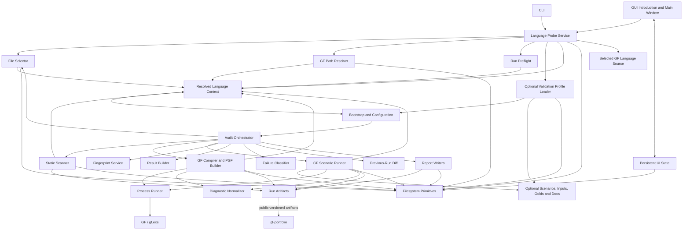

# GF Wordbench — Component Map

**Document ID:** `GF-WB-ARCH-COMPONENT-MAP`  
**Status:** Normative architecture reference  
**Applies to:** GF Wordbench framework, path-resolved language startup, resolved language context, optional validation profiles, validation artifacts, external GF integration, and the public Portfolio-consumer boundary  
**Alignment authority:** `docs/DOCUMENTATION_ALIGNMENT_LOCK.md`  
**Governing startup decision:** `docs/decisions/ADR-0015-PATH-RESOLVED-LANGUAGE-STARTUP.md`  
**Owner:** GF Wordbench maintainers  
**Architecture:** Hexagonal modular monolith  
**Last structural review:** 2026-07-30

---

## 1. Purpose

This document defines the stable components of GF Wordbench and assigns one primary responsibility to each component.

It answers:

- which components exist;
- which files own them;
- which inputs they accept;
- which outputs they produce;
- which artifacts they own;
- which components may call them;
- which dependencies are prohibited;
- where the reusable framework ends and the selected GF language source begins;
- when a responsibility deserves a new component;
- when logic must remain an internal helper.

This document is a map, not a duplicate contract registry.

Detailed request/response guarantees remain authoritative in:

```text
docs/INTERFILE_CONTRACT_LOCK.md
docs/EXTERNAL_TOOL_CONTRACT_LOCK.md
docs/PERSISTED_SCHEMA_LOCK.md
```

When an optional validation profile is loaded, its project-owned contract lock also applies:

```text
project/docs/INTERFILE_CONTRACT_LOCK.md
```

---

## 2. Architectural objective

GF Wordbench is a reusable Python orchestration framework around the Grammatical Framework toolchain.

A Wordbench session has zero or one resolved GF language context. Each ordinary run resolves exactly one language identity, one selected source context, one effective GF path, and one target set.

Normal startup begins from one explicit user-selected GF language directory or `.gf` file. Wordbench derives a bounded candidate and validates it through the existing selection, path, preflight, GF, and diagnostic components. A static global language catalog and a mandatory language bundle are not runtime authorities.

The architecture must preserve these principles:

1. Python orchestrates; GF executes GF semantics.
2. CLI and GUI use the same language-probe, configuration, and audit services.
3. Candidate discovery and executable configuration remain distinct.
4. One immutable `ResolvedLanguageContext` gates main-runtime and run construction.
5. Existing file selection, GF path resolution, preflight, compilation, and diagnostics are reused rather than duplicated.
6. Validation stages return structured results.
7. Raw tool evidence is captured before interpretation.
8. Reports consume results and never rerun validation.
9. Persisted formats have explicit owners and versions.
10. Optional project profiles own scenarios, golds, release gates, and other advanced policy; they are not required for source browsing or targeted compilation.
11. Framework code remains language-neutral and contains no hard-coded language facts.
12. Every cross-file contract has one provider and known consumers.

## 3. System boundary

### 3.1 Inside GF Wordbench

```text
application entrypoints
introduction and language-open surfaces
path-resolved language probing
resolved-language context construction
optional validation-profile loading
bootstrap and dependency composition
audit orchestration
file discovery and deterministic selection
static source scanning
GF path resolution
GF compilation and PGF construction
GF scenario execution
diagnostic normalization
failure classification
result construction
run comparison
report generation
artifact manifest generation
persistent UI state
filesystem and process primitives
optional project scenarios, inputs, golds, and documentation
project-profile template
tests and contract checks
```

### 3.2 Outside GF Wordbench

```text
gf / gf.exe
the installed GF runtime
the selected GF language source tree
the Resource Grammar Library checkout, when used
the operating system
the process API
the filesystem
terminal and desktop environment
optional external tools governed by an accepted contract
gf-portfolio as an optional read-only consumer of public versioned artifacts
```

`gf-portfolio` is an independent product. It may consume finalized public Wordbench artifacts, but GF Wordbench must not import, call, configure, store private state for, or require `gf-portfolio`.

```text
gf-portfolio -> public versioned GF Wordbench artifacts
GF Wordbench -X-> gf-portfolio runtime, code, storage or configuration
```

GF Wordbench does not own GF semantics or the selected language source.

GF Wordbench owns:

- explicit selected-path interpretation;
- bounded language-candidate orchestration;
- resolved-context publication;
- command construction;
- effective GF path resolution;
- process execution policy;
- timeout policy;
- evidence capture;
- artifact verification;
- diagnostic interpretation;
- validation status;
- persistence;
- reporting.

## 4. High-level component flow



The language probe coordinates existing public services. It does not own recursive source selection, GF command construction, subprocess execution, diagnostic parsing, or report writing.

## 5. Modular and hexagonal model

GF Wordbench is organized through five functional modules and six architectural rings.

Functional modules own product capabilities:

| Module | Primary responsibility | Representative components |
|---|---|---|
| `projects` | Selected-path interpretation, language-candidate resolution, immutable language context, optional validation profiles, initialization, migration, and template handoff | language probe, resolved context, profile loader, project template |
| `runs` | Run construction, lifecycle, orchestration, preflight, cancellation, finalization, and run-path ownership | bootstrap, run orchestrator, preflight, state, path allocation |
| `validation` | Deterministic file selection, static scanning, GF path use, GF compilation, PGF construction, and native `.gfs` scenarios | selector, scanner, compiler, scenario runner |
| `diagnostics` | Evidence normalization, fingerprints, result construction, causal classification, and previous-run comparison | diagnostic normalizer, fingerprint service, result builder, classifier, diff |
| `reporting` | Machine, human, and AI-oriented reports, details, logs, and artifact manifests | report writers and manifest publication |

Architectural rings control dependency direction:

| Ring | Purpose | Dependency rule |
|---|---|---|
| `domain` | Stable models, value objects, invariants, and policies | depends on no framework, UI, filesystem, or process implementation |
| `application` | Use cases, language probing, run planning, and coordination | depends on domain and ports |
| `ports` | Interfaces required by application services | contains contracts, not external implementations |
| `adapters` | GF, process, filesystem, persistence, report, and validation-profile implementations | implements ports and depends outward on external systems |
| `entrypoints` | CLI and GUI interaction | invokes application use cases and renders results |
| `bootstrap` | Environment resolution and dependency composition | wires entrypoints, application services, ports, and adapters |

Canonical dependency direction:

```text
entrypoints -> application
bootstrap -> application + ports + adapters
application -> domain + ports
adapters -> ports + external systems
domain -> no outward implementation dependency
```

The `Kind` column in the component registry classifies component responsibility. It does not define a second architectural layer hierarchy.

A component must not bypass its ring boundary, reach into another module's private implementation, create a second production language scanner or GF path resolver, or introduce a reverse dependency from GF Wordbench to `gf-portfolio`.

## 6. Canonical component registry

| ID | Component | Canonical owner | Kind |
|---|---|---|---|
| CMP-ENTRY-CLI | Command-line interface | `app/main_cli.py` | Presentation |
| CMP-ENTRY-GUI | Desktop application entrypoint | `app/main_gui.py` | Presentation |
| CMP-GUI | GUI introduction, views, dialogs, and controls | `app/gui/` | Presentation |
| CMP-CONFIG-DEFAULTS | Framework defaults | `app/config.py` | Configuration |
| CMP-LANGUAGE-PROBE | Path-resolved language probe | `projects/languages/probe.py` | Application service |
| CMP-PROFILE | Optional validation-profile loader and lifecycle service | `app/project_config.py` | Configuration |
| CMP-BOOT | Application and run configuration builder | `app/bootstrap.py` | Configuration |
| CMP-STATE | Persistent UI state | `app/state.py` | Configuration |
| CMP-MODELS | Shared typed models | `app/models.py` | Shared boundary |
| CMP-CORE | Audit orchestrator | `app/audit/audit_core.py` | Orchestration |
| CMP-SELECT | GF file selector | `app/audit/file_selector.py` | Validation stage |
| CMP-SCAN | Static GF source scanner | `app/audit/scanner.py` | Validation stage |
| CMP-COMPILE | GF compiler and PGF builder | `app/audit/compiler.py` | Validation stage |
| CMP-SCENARIO | Native `.gfs` scenario runner | `app/audit/scenario_runner.py` | Validation stage |
| CMP-DIAG | GF diagnostic normalizer | `app/audit/diagnostics.py` | Interpretation |
| CMP-FINGERPRINT | Source fingerprint service | `app/audit/fingerprint.py` | Interpretation |
| CMP-RESULT | Result builder | `app/audit/result_model.py` | Interpretation |
| CMP-CLASSIFY | Direct/downstream failure classifier | `app/audit/classifier.py` | Interpretation |
| CMP-DIFF | Previous-run comparator | `app/audit/diff.py` | Interpretation |
| CMP-REPORT-JSON | Machine-readable summary and manifest writer | `app/reports/report_json.py` | Reporting |
| CMP-REPORT-MD | Human Markdown summary writer | `app/reports/report_md.py` | Reporting |
| CMP-REPORT-AI | AI-ready evidence packet writer | `app/reports/report_ai_ready.py` | Reporting |
| CMP-REPORT-LOGS | Aggregate and top-error log writer | `app/reports/report_logs.py` | Reporting |
| CMP-REPORT-DETAILS | Per-result detail writer | `app/reports/report_details.py` | Reporting |
| CMP-PROCESS | Generic process runner | `app/utils/process_utils.py` | Infrastructure |
| CMP-IO | Filesystem read/write primitives | `app/utils/io_utils.py` | Infrastructure |
| CMP-PATH | Portable path primitives | `app/utils/path_utils.py` | Infrastructure |
| CMP-LOGGING | Runtime logging primitives | `app/utils/logging_utils.py` | Infrastructure |
| CMP-LANGUAGE-CONTEXT | Immutable resolved-language runtime contract | runtime model produced by CMP-LANGUAGE-PROBE | Resolved language |
| CMP-LANGUAGE-SOURCE | Selected GF source tree | explicit selected path and resolved language directory | External project input |
| CMP-PROFILE-CONFIG | Optional advanced validation contract | explicitly selected `project.toml` or compatible profile | Optional profile |
| CMP-PROFILE-SCENARIOS | Optional GF validation scenarios | profile-owned scenario directory | Optional profile |
| CMP-PROFILE-INPUTS | Optional scenario input corpus | profile-owned input directory | Optional profile |
| CMP-PROFILE-GOLD | Optional reviewed expected output | profile-owned gold directory | Optional profile |
| CMP-PROFILE-DOCS | Optional language and validation specification | profile-owned documentation directory | Optional profile |
| CMP-TEMPLATE | Reusable validation-profile template | `templates/project/` | Template |
| CMP-GF | Grammatical Framework executable | external `gf` / `gf.exe` | External |
| EXT-PORTFOLIO | Optional public-artifact consumer | external `gf-portfolio` product | External companion |

The registry identifies architectural owners.

Private helper functions and implementation classes are not separate components unless they acquire an independent contract, lifecycle, artifact, or consumer set.

# 7. Presentation components

## 7.1 CMP-ENTRY-CLI — Command-line interface

**Owner**

```text
app/main_cli.py
```

**Responsibilities**

- define supported command-line commands and options;
- accept one explicit language directory or `.gf` path for path-resolved operations;
- accept an optional explicit validation profile;
- convert textual arguments into plain Python values;
- invoke the shared language-probe service;
- request configuration construction from `app/bootstrap.py` after resolution;
- invoke the audit orchestrator;
- render structured probe and validation diagnostics;
- map terminal outcomes to process exit codes;
- expose documented contract, schema, profile, and gold maintenance commands.

**Consumes**

```text
LanguageProbeService
app/bootstrap.py
app/audit/audit_core.py
app/models.py
```

**Produces**

```text
LanguageProbeRequest
RunConfig request
terminal output
CLI exit code
```

**Must not**

- enumerate GF files independently;
- infer language identity with CLI-only rules;
- build `ResolvedLanguageContext` or `RunConfig` independently;
- call scanner, compiler, scenario runner, classifier, or report writers directly;
- parse GF output;
- reconstruct report paths;
- contain language-specific defaults;
- persist GUI state.

## 7.2 CMP-ENTRY-GUI — Desktop application entrypoint

**Owner**

```text
app/main_gui.py
```

**Responsibilities**

- initialize the GUI runtime;
- construct the introduction runtime before the main runtime;
- load safe non-authoritative UI state;
- display actions to open the last path, choose a directory or `.gf` file, configure required local tools, or quit;
- invoke the shared language-probe service;
- create the main runtime only after one complete `ResolvedLanguageContext` exists;
- convert uncaught startup failures into clear user-facing errors.

**Consumes**

```text
LanguageProbeService
app/bootstrap.py
app/state.py
app/gui/
```

**Must not**

- define validation or discovery semantics;
- enumerate GF files directly;
- resolve GF paths directly;
- call GF directly;
- create a separate configuration model;
- create the main runtime after a partial language resolution;
- make the framework depend on the GUI toolkit for CLI execution.

## 7.3 CMP-GUI — GUI views and controls

**Owner**

```text
app/gui/
├── startup.py
├── main_window.py
├── dialogs.py
├── validators.py
└── widgets.py
```

**Responsibilities**

- collect an explicit language directory or `.gf` selection;
- present remembered-path actions without treating state as authority;
- display language candidates, capability statuses, ambiguity, and remediation;
- collect an optional validation-profile selection;
- display preflight validation;
- launch the same probe and audit services used by the CLI;
- display progress and completed results;
- request a language switch only when no run is active;
- open generated artifacts;
- save disposable UI preferences through `app/state.py`.

**Consumes**

```text
LanguageProbeService
app/bootstrap.py
app/audit/audit_core.py
app/state.py
app/models.py
```

**Must not**

- duplicate language probing, file selection, or audit stages;
- bypass `run_audit`;
- treat widget values or remembered values as validated runtime configuration;
- mutate an active language context in place;
- parse `summary.md` to recover structured results;
- modify gold files during normal validation.

# 8. Configuration components

## 8.1 CMP-CONFIG-DEFAULTS — Framework defaults

**Owner**

```text
app/config.py
```

**Responsibilities**

- application name and package version;
- framework-level default timeout;
- framework-level default output behavior;
- canonical artifact filenames;
- safe default flags;
- compatibility constants;
- state filename;
- non-language-specific defaults.

**Produces**

```text
constants consumed by bootstrap, state, reports, and paths
```

**Must not contain**

- active language name or directory;
- module suffix;
- source directory for a specific language;
- language entrypoints or checkpoints;
- language-specific scan rules;
- a runtime language catalog;
- developer-local absolute paths.

Language-specific runtime facts belong to `ResolvedLanguageContext`. Advanced project policy belongs to an explicitly loaded validation profile.

---

## 8.2 CMP-LANGUAGE-PROBE — Path-resolved language probe

**Owner**

```text
projects/languages/probe.py
```

**Responsibilities**

- interpret one explicit selected directory or `.gf` file;
- derive the candidate language directory;
- locate a supported RGL source root through a bounded ancestor walk;
- coordinate deterministic source enumeration through CMP-SELECT;
- classify standard RGL module-role candidates without claiming GF semantics;
- coordinate effective GF path resolution through the canonical path owner;
- coordinate structural preflight;
- produce typed resolution, ambiguity, and remediation diagnostics;
- construct one immutable `ResolvedLanguageContext`;
- compute source-ready, scan-ready, compile-ready, scenario-ready, and release-ready capability statuses;
- preserve resolution provenance.

**Consumes**

```text
LanguageProbeRequest
CMP-SELECT public contract
CMP-PATH and canonical GF-path resolution contracts
preflight public contract
CMP-DIAG typed diagnostics where applicable
filesystem port
optional ValidationProfileConfig
```

**Produces**

```text
LanguageCandidate
LanguageProbeResult
ResolvedLanguageContext
CapabilityStatus set
resolution diagnostics
```

**Must not**

- perform a global startup scan of every RGL language;
- read a static catalog as runtime authority;
- duplicate recursive selection, filtering, sorting, or containment logic;
- parse full GF semantics or build a competing dependency graph;
- construct raw GF commands;
- invoke subprocess directly;
- parse GF console text when CMP-DIAG owns a typed interpretation;
- write reports or application state;
- silently resolve ambiguity by first match.

The language probe is an orchestration boundary, not a second scanner or compiler.

---

## 8.3 CMP-PROFILE — Optional validation-profile loader and lifecycle service

**Owner**

```text
app/project_config.py
```

**Responsibilities**

- load `project.toml` or another supported validation profile only when explicitly selected or configured;
- validate schema identity and version;
- parse advanced validation policy;
- resolve profile-relative paths;
- validate profile identity against the resolved language context;
- validate unique configured entrypoints, checkpoints, and scenario IDs;
- expose a typed `ValidationProfileConfig`;
- initialize a profile from `templates/project/`;
- validate reset preconditions;
- support explicit profile migration;
- keep the template language-neutral.

**Consumes**

```text
explicit validation-profile path
templates/project/
docs/PERSISTED_SCHEMA_LOCK.md
ResolvedLanguageContext
```

**Produces**

```text
ValidationProfileConfig
profile initialization result
profile validation diagnostics
```

**Must not**

- become mandatory for opening or scanning a standard language source;
- run an audit;
- invoke GF;
- silently search ancestors for a profile;
- silently rewrite an existing profile;
- override or contradict the resolved language identity;
- merge two active languages;
- use undocumented fallback paths.

The profile loader is the only framework component allowed to interpret the semantic meaning of `project.toml`.

---

## 8.4 CMP-BOOT — Application and run configuration builder

**Owner**

```text
app/bootstrap.py
```

**Responsibilities**

- compose the introduction runtime independently of the main runtime;
- build immutable or effectively immutable application configuration;
- accept one complete `ResolvedLanguageContext`;
- combine framework defaults, resolved language facts, optional validation-profile policy, and permitted explicit user overrides;
- validate required environment paths;
- build the resolved `RunConfig`;
- request the canonical effective GF path resolution rather than duplicating it;
- validate capability- and mode-specific requirements;
- create or request run-path construction;
- perform or request non-executing preflight validation;
- recreate the main runtime when language selection changes.

**Consumes**

```text
app/config.py
ResolvedLanguageContext
optional ValidationProfileConfig
app/models.py
app/utils/path_utils.py
```

**Produces**

```text
IntroductionRuntime
AppConfig
ResolvedLanguageContext reference
optional ValidationProfileConfig
RunConfig
RunPaths
MainRuntime
```

**Precedence**

```text
explicit permitted run value
→ explicit validation-profile policy
→ resolved language context
→ framework default
```

Remembered UI state never participates in semantic precedence. Required release constraints must not be bypassed by UI state.

**Must not**

- discover languages;
- execute validation;
- write reports;
- classify errors;
- embed GUI types in shared application models;
- mutate a resolved language context or validation profile.

---

## 8.5 CMP-STATE — Persistent UI state

**Owner**

```text
app/state.py
```

**Artifact**

```text
.gf_wordbench_state.json
```

**Responsibilities**

- persist disposable UI preferences;
- remember recent local paths;
- remember the last successfully selected language path;
- remember an optional recent validation-profile path;
- restore safe selections as candidates only;
- import documented legacy state;
- fall back safely when state is absent or malformed;
- write state atomically.

**May store**

```text
last selected language path
recent validation-profile path
recent RGL root
recent GF executable
recent output root
last selected validation mode
non-authoritative UI preferences
last completed run pointers
```

**Must not store**

```text
an authoritative resolved language context
active language identity as a substitute for path resolution
required scenarios
entrypoints or checkpoints as runtime authority
audit results
runtime objects
running state restored as true
credentials
tokens
secrets
```

Every remembered language or profile path is fully revalidated before reuse.

# 9. Shared model component

## 9.1 CMP-MODELS — Shared typed models

**Owner**

```text
app/models.py
```

**Responsibilities**

Define canonical boundary models, including:

```text
AppConfig
LanguageProbeRequest
LanguageCandidate
LanguageProbeDiagnostic
LanguageProbeResult
ResolvedLanguageContext
CapabilityStatus
ValidationProfileConfig
RunConfig
RunPaths
ProcessResult
ScanCounts
SourceFingerprint
CompileSummary
FileResult
ScenarioResult
DiffEntry
TopError
RunResult
```

**Model rules**

- models describe data, not orchestration;
- `LanguageCandidate` is provisional and non-executable;
- `ResolvedLanguageContext` is immutable and is the only language authority used by the main runtime;
- capability status remains distinct from validation status;
- validation statuses use one canonical enum;
- diagnostic classes use one canonical enum;
- error kinds use one canonical enum;
- execution state remains distinct from validation status;
- persisted fields remain compatible with `PERSISTED_SCHEMA_LOCK.md`;
- serialization helpers must be deterministic;
- model defaults must be explicit;
- language-specific linguistic structures and hard-coded language names do not belong here.

**May depend on**

```text
Python standard library
small pure typing helpers
```

**Must not depend on**

```text
GUI
reports
compiler
scanner
scenario runner
audit orchestrator
language-specific modules
```

# 10. Orchestration component

## 10.1 CMP-CORE — Audit orchestrator

**Owner**

```text
app/audit/audit_core.py
```

**Primary public service**

```python
run_audit(run_config: RunConfig) -> RunResult
```

The exact signature is governed by the interfile contract lock.

**Responsibilities**

- establish the run lifecycle;
- create run directories through the path owner;
- record start and finish metadata;
- execute the stage plan for the selected mode;
- call stages in deterministic order;
- contain expected stage failures;
- request result construction;
- request relationship classification;
- request previous-run comparison;
- invoke report writers once validation is complete;
- finalize the run outcome;
- return one complete `RunResult`.

**Mode planning**

```text
quick
checkpoint
release
diagnostic
```

The orchestrator owns the mapping from mode to required stages.

**Must not**

- implement scanner rules;
- build raw GF command lines directly;
- parse GF diagnostics directly;
- implement report formatting;
- own resolved language identity or profile semantics;
- hide a failed required stage;
- rerun a stage merely to complete a report.

---

# 11. Validation-stage components

## 11.1 CMP-SELECT — GF file selector

**Owner**

```text
app/audit/file_selector.py
```

**Responsibilities**

- validate source roots supplied through public requests;
- enumerate candidate `.gf` files;
- apply configured source glob, include, and exclude rules;
- normalize approved-root-relative paths;
- enforce deterministic ordering;
- support explicit target-file selection;
- expose module-name expectations from GF filenames through one public contract;
- report inclusion and exclusion reasons;
- prevent files outside approved roots from entering probing or validation.

**Consumes**

```text
selection request
ResolvedLanguageContext or candidate approved root
optional ValidationProfileConfig
filesystem port
```

**Produces**

```text
ordered selected files
selection statistics
exclusion records
module-name expectations
```

**Must not**

- choose the active language;
- infer a complete language context;
- read GF semantics;
- scan source text;
- compile;
- classify failures;
- use GUI state directly.

CMP-LANGUAGE-PROBE reuses this component. It must not reproduce its enumeration, filtering, containment, deduplication, or ordering rules.

## 11.2 CMP-SCAN — Static GF source scanner

**Owner**

```text
app/audit/scanner.py
```

**Responsibilities**

- read selected GF source;
- mask comments and string literals where required;
- apply registered static checks;
- create structured `ScanCounts`;
- preserve per-file scan evidence;
- write one owned scan log per file;
- return findings without deciding compilation success.

**Produces**

```text
ScanCounts
scan evidence
scan log path
```

**Must not**

- compile GF;
- execute external processes;
- classify direct versus downstream failure;
- duplicate rules in generic utility modules;
- modify project source.

All static rule definitions belong to the scanner or a scanner-owned private rule module.

A generic `gf_utils.py` must not become a second scanner.

---

## 11.3 CMP-COMPILE — GF compiler and PGF builder

**Owner**

```text
app/audit/compiler.py
```

**Responsibilities**

- construct the documented GF compilation request from one resolved context and explicit target set;
- compile individual modules;
- compile profile-configured checkpoints when present;
- compile profile-configured release entrypoints when present;
- build a release PGF only when release policy requires it;
- consume the canonical effective GF path resolution;
- call the generic process runner;
- preserve command, working directory, environment policy, streams, exit code, timeout, and duration;
- verify required `.gfo` and `.pgf` artifacts;
- return structured compile evidence.

**Consumes**

```text
RunConfig
ResolvedLanguageContext
optional ValidationProfileConfig
selected GF files
canonical GFPathResolution
app/utils/process_utils.py
app/audit/diagnostics.py
```

**Produces**

```text
CompileSummary
raw compile stdout/stderr
.gfo artifacts
.pgf artifact when requested
```

**Must not**

- discover the language directory;
- construct a competing GF path;
- implement generic subprocess logic;
- classify direct or downstream relationships;
- generate reports;
- treat zero exit code as sufficient when a required artifact is missing;
- reuse stale artifacts as current evidence;
- write into selected source directories when isolated run artifacts are required.

PGF construction remains part of the compiler component because it uses the same GF compilation boundary and artifact-verification policy.

A separate PGF component should be introduced only if it gains an independent API, lifecycle, or consumer set.

## 11.4 CMP-SCENARIO — Native `.gfs` scenario runner

**Owner**

```text
app/audit/scenario_runner.py
```

**Responsibilities**

- discover scenarios only from an explicit validation profile or explicit scenario request;
- validate scenario metadata and paths;
- execute `.gfs` scripts through the generic process runner;
- consume the same effective GF path resolution used by compilation;
- preserve raw stdout and stderr;
- verify stable begin/end markers;
- normalize unstable environmental output;
- preserve linguistically meaningful output;
- compare normalized output with reviewed gold files when configured;
- collect scenario-produced artifacts;
- return deterministic `ScenarioResult` objects;
- support explicit gold-update operations separate from normal validation.

**Consumes**

```text
ResolvedLanguageContext
ValidationProfileConfig or explicit scenario request
RunConfig
profile-owned scenarios, inputs, and golds
canonical GFPathResolution
app/utils/process_utils.py
app/audit/diagnostics.py
```

**Produces**

```text
ScenarioResult
raw scenario stdout/stderr
normalized scenario output
gold comparison result
gold diff
scenario artifacts
```

**Must not**

- require scenarios for basic language loading;
- discover an implicit project profile;
- implement an alternative Python GF shell;
- silently ignore unsupported GF commands;
- rewrite gold files during normal validation;
- remove semantic GF output during normalization;
- treat zero process exit as complete success when required markers are absent;
- call report writers.

Normalization and gold comparison remain scenario-runner-owned internal services unless their independent complexity justifies extraction.

# 12. Interpretation components

## 12.1 CMP-DIAG — GF diagnostic normalizer

**Owner**

```text
app/audit/diagnostics.py
```

**Responsibilities**

- accept raw stdout, stderr, exit metadata, and stage context;
- identify stable diagnostic evidence;
- normalize path and formatting noise for interpretation;
- determine technical `error_kind`;
- identify a primary diagnostic message;
- preserve raw evidence references;
- expose one shared diagnostic interpretation for compiler and scenario runner.

**Produces**

```text
normalized diagnostic record
error_kind
primary_message
diagnostic details
```

**Must not**

- decide direct versus downstream causality;
- execute GF;
- modify raw evidence;
- generate human reports;
- contain project-specific error rules unless supplied through explicit project policy.

There must be one diagnostic normalization path.

Consumers must not independently parse the same raw GF output using competing rules.

---

## 12.2 CMP-FINGERPRINT — Source fingerprint service

**Owner**

```text
app/audit/fingerprint.py
```

**Responsibilities**

- calculate canonical source hashes;
- record file size;
- record normalized modification time when required;
- provide deterministic source identity;
- support stale-artifact detection and run comparison.

**Produces**

```text
SourceFingerprint
```

**Must not**

- classify content;
- infer semantic equivalence;
- modify source;
- rely on unstable abbreviated hashes for canonical v1 output.

---

## 12.3 CMP-RESULT — Result builder

**Owner**

```text
app/audit/result_model.py
```

**Responsibilities**

- combine scan evidence, fingerprint, compile evidence, and scenario evidence into shared models;
- enforce model invariants;
- provide safe default values;
- ensure paths use canonical bases;
- construct completed per-file and per-scenario results;
- aggregate run totals.

**Produces**

```text
FileResult
ScenarioResult
RunResult
```

**Must not**

- execute stages;
- parse raw GF text independently;
- format reports;
- infer dependency relationships beyond documented input evidence.

---

## 12.4 CMP-CLASSIFY — Failure relationship classifier

**Owner**

```text
app/audit/classifier.py
```

**Responsibilities**

- distinguish direct, downstream, ambiguous, noise, skipped, and successful results;
- resolve known blockers;
- classify relationships across file results;
- preserve the distinction between causal class and technical error kind;
- provide deterministic blocker ordering.

**Consumes**

```text
structured FileResult evidence
dependency information available to the run
```

**Produces**

```text
updated diagnostic_class
is_direct
blocked_by
classification evidence
```

**Must not**

- execute processes;
- parse raw logs using private rules;
- change validation status merely to simplify reporting;
- classify a missing framework capability as a language error.

---

## 12.5 CMP-DIFF — Previous-run comparator

**Owner**

```text
app/audit/diff.py
```

**Responsibilities**

- locate the previous eligible run;
- require compatible resolved language identity and source-context evidence;
- load supported current or legacy summaries;
- normalize identity paths;
- compare file, scenario, and run status;
- classify changes as improved, regressed, new, removed, or unchanged;
- produce deterministic `DiffEntry` ordering.

**Consumes**

```text
current RunResult
previous summary.json
persisted schema migration rules
```

**Produces**

```text
list[DiffEntry]
```

**Must not**

- compare human Markdown reports;
- modify previous runs;
- silently reinterpret unsupported schema versions;
- rerun validation.

---

# 13. Reporting components

All report writers consume the completed `RunResult`.

They must not execute GF or validation stages.

## 13.1 CMP-REPORT-JSON — Machine summary and manifest

**Owner**

```text
app/reports/report_json.py
```

**Owns**

```text
summary.json
manifest.json
```

**Responsibilities**

- serialize the canonical run summary;
- emit schema identity and version;
- preserve deterministic collection ordering;
- use canonical path bases;
- write atomically;
- write the artifact manifest after report artifacts are finalized;
- calculate final artifact hashes;
- exclude the manifest from hashing itself;
- support documented compatibility output only through explicit migration tooling.

A separate manifest writer should be extracted only if manifest generation gains a distinct lifecycle or independent consumers that justify another public component.

---

## 13.2 CMP-REPORT-MD — Human summary

**Owner**

```text
app/reports/report_md.py
```

**Owns**

```text
summary.md
```

**Responsibilities**

- render concise run metadata;
- render outcome totals;
- list file and scenario results;
- show regression comparison;
- link artifacts;
- preserve required headings.

**Must not**

- become the source of truth for automation;
- infer facts absent from `RunResult`;
- parse another report.

---

## 13.3 CMP-REPORT-AI — AI-ready packet

**Owner**

```text
app/reports/report_ai_ready.py
```

**Owns**

```text
AI_READY.md
```

**Responsibilities**

- provide a bounded, self-contained evidence packet;
- distinguish direct, downstream, and ambiguous failures;
- reference raw evidence;
- include relevant artifact paths;
- avoid unsupported diagnosis;
- avoid secrets and complete environment dumps.

**Must not**

- rerun GF;
- rerun scans;
- rewrite missing evidence;
- fabricate a primary cause.

---

## 13.4 CMP-REPORT-LOGS — Aggregate logs

**Owner**

```text
app/reports/report_logs.py
```

**Owns**

```text
top_errors.txt
raw/ALL_SCAN_LOGS.TXT
raw/ALL_LOGS.TXT
```

It may aggregate but must not replace stage-owned raw files.

**Responsibilities**

- combine references or copies deterministically;
- write canonical top-error ordering;
- preserve source attribution;
- handle missing optional logs explicitly.

---

## 13.5 CMP-REPORT-DETAILS — Per-result details

**Owner**

```text
app/reports/report_details.py
```

**Owns**

```text
details/
```

**Responsibilities**

- produce bounded per-file and per-scenario detail views;
- link or copy relevant evidence;
- honor the `keep_ok_details` policy;
- avoid duplicating large raw evidence without need.

---

# 14. Infrastructure components

## 14.1 CMP-PROCESS — Generic process runner

**Owner**

```text
app/utils/process_utils.py
```

**Responsibilities**

- launch a process without shell-string interpolation;
- preserve ordered arguments;
- set the documented working directory;
- apply controlled environment changes;
- send optional standard input;
- capture stdout and stderr;
- enforce timeout;
- terminate safely;
- record duration;
- return a structured process result.

**Produces**

```text
ProcessResult
```

**Must not**

- know GF syntax;
- classify GF errors;
- import audit result models beyond the generic process-result type;
- write reports;
- choose the resolved language or validation profile;
- silently retry with different semantics.

---

## 14.2 CMP-IO — Filesystem primitives

**Owner**

```text
app/utils/io_utils.py
```

**Responsibilities**

- UTF-8 text reads and writes;
- binary reads and writes;
- safe directory creation;
- atomic file replacement;
- bounded reads;
- explicit copy operations;
- safe JSON/TOML byte handling primitives where generic.

**Must not**

- assign artifact ownership;
- interpret schemas;
- choose run paths;
- hide I/O errors needed by callers.

---

## 14.3 CMP-PATH — Portable path primitives

**Owner**

```text
app/utils/path_utils.py
```

**Responsibilities**

- normalized path comparison;
- root-containment validation;
- safe relative-path calculation;
- portable `/` serialization;
- path-safe filename fragments;
- Windows path handling;
- deterministic run-path primitives.

**Must not**

- embed hard-coded language directories;
- resolve project semantics;
- invent artifact filenames owned by reports or stages.

---

## 14.4 CMP-LOGGING — Runtime logging primitives

**Owner**

```text
app/utils/logging_utils.py
```

**Responsibilities**

- configure runtime logger instances;
- route application messages;
- avoid duplicate handlers;
- provide consistent log levels;
- redact protected values where policy requires.

Runtime logging is not a substitute for stage-owned raw evidence.

---

# 15. Resolved-language and optional-profile components

## 15.1 CMP-LANGUAGE-CONTEXT — Resolved language runtime contract

**Owner**

```text
immutable model produced by CMP-LANGUAGE-PROBE
```

**Responsibilities**

- portable language key;
- exact selected path and path kind;
- resolved language directory;
- resolved RGL source root and RGL root when available;
- selected file or focused target when applicable;
- unambiguous module suffix when available;
- detected entrypoint candidates;
- approved source inventory or stable inventory reference;
- GF path requirements and resolution provenance;
- structural diagnostics;
- capability statuses;
- optional validation-profile identity and digest.

It is the single provider of language and source facts for one main runtime and its runs.

It is never mutated. A language or profile change produces a new context and a new runtime.

---

## 15.2 CMP-LANGUAGE-SOURCE — Selected GF source tree

**Owner**

```text
explicit user-selected directory or .gf file and the resolved language directory
```

**Responsibilities**

- abstract and concrete grammar implementation;
- resources;
- morphology;
- paradigms;
- syntax;
- structural modules;
- extensions;
- lexicon;
- entrypoints and ordinary GF modules.

The selected source tree is external project input. Normal Wordbench probing and validation are read-only.

Wordbench may inspect and validate this source through approved filesystem, selector, scanner, and GF boundaries. Source files must not import Python framework internals.

---

## 15.3 CMP-PROFILE-CONFIG — Optional advanced validation contract

**Owner**

```text
explicitly selected project.toml or another supported validation-profile file
```

**Responsibilities**

- project-policy metadata;
- source filters;
- configured entrypoints and checkpoints;
- required and optional scenarios;
- GF path requirements beyond standard resolution;
- release requirements;
- expected artifacts;
- profile-owned paths.

A profile extends validation policy. It does not replace the selected path or resolved language identity.

---

## 15.4 CMP-PROFILE-SCENARIOS — Optional validation scenarios

**Owner**

```text
scenario directory referenced by the explicit validation profile
```

**Responsibilities**

- native GF shell validation;
- load checks;
- missing-linearization checks;
- linearization;
- parsing;
- bounded generation;
- morphology or language-specific checks;
- stable scenario markers.

A language without configured scenarios may still be source-ready, scan-ready, and compile-ready.

---

## 15.5 CMP-PROFILE-INPUTS — Optional scenario inputs

**Owner**

```text
input directory referenced by the explicit validation profile
```

**Responsibilities**

- reviewed input phrases;
- reviewed trees;
- bounded lexical inputs;
- deterministic scenario corpora;
- language-specific fixtures.

Inputs must be version-controlled and identified by consuming scenarios.

---

## 15.6 CMP-PROFILE-GOLD — Optional reviewed expected output

**Owner**

```text
gold directory referenced by the explicit validation profile
```

**Responsibilities**

- accepted normalized scenario output;
- explicit scenario identity;
- explicit normalization version;
- reviewed semantic expectations.

Normal validation is read-only. Missing golds affect only capabilities or modes that explicitly require them.

---

## 15.7 CMP-PROFILE-DOCS — Optional language and validation specification

**Owner**

```text
documentation directory referenced by the explicit validation profile
```

**Responsibilities**

- language architecture;
- dependency map;
- category and lincat contract;
- morphology specification;
- syntax and constructor rules;
- validation specification;
- coverage matrix;
- decision log;
- known issues;
- release criteria;
- research evidence.

Profile documentation describes the language or validation policy. It must not redefine framework behavior and is not required for basic startup.

---

## 15.8 CMP-TEMPLATE — Reusable validation-profile template

**Owner**

```text
templates/project/
```

**Responsibilities**

- provide a canonical empty advanced-validation layout;
- provide language-neutral configuration;
- provide documentation templates;
- provide scenario, input, and gold directory templates;
- contain placeholders only where explicitly intended.

The template is used only by explicit profile initialization. It does not participate in path-resolved startup and must not retain data from a loaded language or profile.

# 16. External components

## 16.1 CMP-GF — Grammatical Framework

**Provider**

```text
gf
gf.exe
```

**GF responsibilities**

- parse GF source;
- type-check GF modules;
- compile `.gf` to `.gfo`;
- construct `.pgf`;
- execute GF shell commands;
- load grammars;
- linearize;
- parse;
- generate;
- expose GF diagnostics.

**GF Wordbench responsibilities at this boundary**

- resolve executable;
- build valid requests;
- preserve raw response;
- enforce timeout;
- verify artifacts;
- interpret response consistently;
- maintain version-compatibility policy.

The complete boundary is governed by:

```text
docs/EXTERNAL_TOOL_CONTRACT_LOCK.md
```

---


## 16.2 EXT-PORTFOLIO — Optional Portfolio consumer

**Provider**

```text
gf-portfolio
```

**Permitted interaction**

- discover or register several independent Wordbench workspaces in Portfolio-owned state;
- read finalized public Wordbench artifacts;
- index, compare and aggregate results in Portfolio-owned schemas;
- preserve Wordbench project and run identities;
- handle incompatible public schema versions without mutating Wordbench artifacts.

**Must not**

- import private Wordbench modules;
- modify validation profiles, scenarios, golds, selected source, or run artifacts;
- become required for Wordbench startup, validation, reporting or tests;
- share a private database or mandatory runtime service with Wordbench;
- cause Wordbench schemas to contain Portfolio registry or aggregation state.

The complete product boundary is governed by ADR-0011, ADR-0012 and `docs/DOCUMENTATION_ALIGNMENT_LOCK.md`.

---

# 17. Core data flow

## 17.1 Language-startup flow

```text
explicit CLI or GUI selected path
    + safe non-authoritative state candidate
        ↓
LanguageProbeService
    → public file selector
    → canonical path and containment services
    → canonical GF path resolver
    → structural preflight
        ↓
LanguageProbeResult
        ↓
ResolvedLanguageContext
    + optional explicit ValidationProfileConfig
    + framework defaults and permitted overrides
        ↓
app/bootstrap.py
        ↓
AppConfig + RunConfig + RunPaths + MainRuntime
```

A static language catalog and a mandatory `project.toml` are absent from the normal startup path.

## 17.2 File-validation flow

```text
ResolvedLanguageContext
+ RunConfig
    ↓
file_selector
    ↓
selected GF file
    ├──→ fingerprint
    ├──→ scanner
    └──→ compiler → process runner → GF
                         ↓
                   raw evidence
                         ↓
                    diagnostics
                         ↓
                   result builder
                         ↓
                    classifier
```

## 17.3 Scenario flow

```text
explicit ValidationProfileConfig or explicit scenario request
+ ResolvedLanguageContext
    ↓
scenario_runner
    ↓
process runner
    ↓
GF executes .gfs
    ↓
raw stdout/stderr
    ↓
marker validation
    ↓
output normalization
    ↓
optional gold comparison
    ↓
ScenarioResult
```

## 17.4 Language-switch flow

```text
switch request
    ↓
verify no active run
    ↓
dispose current workers and main runtime
    ↓
return to introduction surface
    ↓
probe another explicit path
    ↓
construct a new ResolvedLanguageContext
    ↓
compose a new main runtime
```

No selected file, GF path, profile asset, baseline, or result state survives from the old runtime.

## 17.5 Finalization flow

```text
FileResult[]
+ ScenarioResult[]
+ resolved-language evidence
+ run metadata
    ↓
RunResult
    ↓
previous-run compatibility and diff
    ↓
report_json
report_md
report_ai_ready
report_logs
report_details
    ↓
manifest finalization
```

# 18. Validation-mode participation

| Component | Source open | Quick | Checkpoint | Release | Diagnostic |
|---|---:|---:|---:|---:|---:|
| Language probe | Required | Required | Required | Required | Required |
| Optional profile loader | No | Optional | Usually required | Required | Optional |
| File selector | Inventory | Targeted | Configured set | Required set | Broad set |
| Scanner | Optional | Yes | Yes | Yes | Yes |
| Compiler | No | Targeted when compile-ready | Checkpoints | Checkpoints and entrypoints | Broad |
| PGF build | No | No by default | Optional | Required when configured | Optional |
| Scenario runner | No | Minimal/optional | Required where configured | All required release scenarios | Selected diagnostic scenarios |
| Gold comparison | No | Optional | Required where configured | Required where configured | Optional |
| Classifier | No | Yes | Yes | Yes | Yes |
| Diff | No | Optional | Yes | Yes | Yes |
| Reports | No | Yes | Yes | Yes | Yes |
| Manifest | No | Yes | Yes | Yes | Yes |

Capability status gates participation:

```text
source-ready  → browse and target selection
scan-ready    → static scanning
compile-ready → GF compilation
scenario-ready → scenario execution
release-ready → complete release policy and gates
```

The exact stage plan is owned by `audit_core.py` and the validation-mode specification.

# 19. Artifact ownership summary

| Artifact or value | Owner |
|---|---|
| application state | `app/state.py` |
| language candidate and probe diagnostics | CMP-LANGUAGE-PROBE |
| immutable `ResolvedLanguageContext` | CMP-LANGUAGE-PROBE / shared-model owner |
| optional validation-profile configuration | `app/project_config.py` |
| selected-file inventory | `app/audit/file_selector.py` or run-result owner |
| effective GF path resolution | canonical GF-path resolver |
| per-file scan log | `app/audit/scanner.py` |
| compile stdout/stderr | `app/audit/compiler.py` |
| scenario stdout/stderr | `app/audit/scenario_runner.py` |
| normalized scenario output | `app/audit/scenario_runner.py` |
| gold diff | `app/audit/scenario_runner.py` |
| `.gfo` | GF compile stage through `compiler.py` |
| `.pgf` | GF PGF stage through `compiler.py` |
| `summary.json` | `app/reports/report_json.py` |
| `manifest.json` | `app/reports/report_json.py` |
| `summary.md` | `app/reports/report_md.py` |
| `AI_READY.md` | `app/reports/report_ai_ready.py` |
| `top_errors.txt` | `app/reports/report_logs.py` |
| aggregate logs | `app/reports/report_logs.py` |
| `details/` | `app/reports/report_details.py` |
| optional `project.toml` | profile maintainers |
| optional `.gold` | profile maintainers through explicit update workflow |
| selected GF source | external source maintainers |

A `ResolvedLanguageContext` is a runtime value, not a portable configuration file. An observer may read but must not rewrite another component's artifact or value.

# 20. Dependency rules

## 20.1 Expected directions

```text
CLI/GUI
    → language probe
    → bootstrap
    → shared models

language probe
    → public file selector
    → canonical GF path resolver
    → public preflight service
    → public diagnostic models
    → optional validation-profile loader

CLI/GUI
    → audit core after a resolved context exists

audit core
    → file selector
    → scanner
    → compiler
    → scenario runner
    → fingerprint
    → result builder
    → classifier
    → diff
    → reports

compiler/scenario runner
    → process runner
    → canonical GF path resolution

probe/stages/reports/state/profile loader
    → filesystem and path primitives

reports
    → completed models and resolved-language evidence

selected GF source
    → GF through approved validation requests

public Wordbench artifacts
    → optional gf-portfolio consumer
```

## 20.2 Prohibited directions

```text
reports → compiler
reports → scanner
reports → scenario runner
reports → process execution

models → reports
models → GUI
models → audit core

process runner → compiler
process runner → scenario runner
process runner → diagnostics

scanner → compiler
compiler → reports
classifier → process execution
diagnostics → process execution

language probe → private selector helpers
language probe → process runner
language probe → report writers
language probe → GUI widgets
language probe → global runtime catalog

validation profile → application state
framework defaults → active-language identity
application state → executable resolved context without revalidation

GUI widgets → GF
GUI widgets → compiler
GUI widgets → recursive language enumeration
CLI parser → scanner
CLI parser → reports
CLI parser → language inference rules

selected GF source → Python framework internals
template profile → active resolved context

GF Wordbench → gf-portfolio runtime, storage, code, or configuration
```

Circular dependencies between architectural layers are prohibited.

# 21. Component creation threshold

A new file is not automatically a new component.

Create a new architectural component only when at least one of these is true:

1. it owns a distinct public contract;
2. it owns a distinct persisted artifact;
3. it has independent consumers;
4. it has a distinct lifecycle;
5. it requires independent compatibility policy;
6. it forms a trust or security boundary;
7. it requires isolated integration tests;
8. retaining it inside the current owner would create conflicting responsibilities.

Keep logic internal when it is:

- used by one owner only;
- private and replaceable;
- not independently configured;
- not independently persisted;
- not consumed across a file boundary;
- not a separate trust boundary.

Examples:

- scenario marker parsing may remain private to `scenario_runner.py`;
- gold comparison may remain private to `scenario_runner.py`;
- manifest generation may remain in `report_json.py`;
- PGF build may remain in `compiler.py`;
- scanner rules may remain scanner-owned private helpers.

Extract them only after an independent boundary becomes real.

---

# 22. Deliberately rejected components

The architecture does not include separate components for:

```text
a Python reimplementation of the GF shell
one component per GF shell command
one component per scanner rule
one component per validation mode
one component per result status
one component per schema field
a second report-time diagnostic engine
a second GUI-specific audit engine
a second CLI-specific configuration builder
a second recursive GF file selector
a second GF path resolver
a second GF compiler
a global runtime language-catalog reader
a mandatory language-bundle renderer at startup
language-specific framework plugins
```

The one new language-probe component is justified because it owns a distinct public result, lifecycle, ambiguity contract, security boundary, and CLI/GUI consumer set. Its internal classification helpers remain private and must delegate existing selection, path, GF, and diagnostic behavior to their owners.

# 23. Legacy and migration boundaries

GF Wordbench preserves documented compatibility with relevant `gf-audit` and project-profile artifacts and behaviors.

The following compatibility elements may exist during migration but are not independent architectural owners:

```text
legacy application name: gf-audit
legacy state: .gf_audit_state.json
legacy modes: all, file
legacy report aliases
legacy absolute paths in summaries
legacy helper duplication in app/utils/gf_utils.py
temporary adapters for old RunResult fields
mandatory project/project.toml startup
catalog-driven language selection
last_language_id state without a selected path
mandatory language-bundle startup
```

Canonical replacements include:

```text
gf-wordbench
.gf_wordbench_state.json
path-resolved language startup
last_selected_language_path
immutable ResolvedLanguageContext
optional explicit ValidationProfileConfig
diagnostic
quick
versioned persisted schemas
portable language and source identities
single scanner rule owner
single file-selection owner
single GF path owner
```

A migration adapter may read legacy data or translate an old catalog selection into an explicit selected path during a version-bounded compatibility period.

It must not cause canonical writers or the main runtime to continue treating the catalog, a remembered ID, or `project.toml` as mandatory startup authority.

`app/utils/gf_utils.py` must either:

1. be reduced to narrowly reusable GF-neutral helpers with no duplicated scanner, compiler, diagnostics, language-probe, or path ownership; or
2. be retired after its consumers migrate to the designated owners.

It must not remain a competing architectural component.

# 24. Test ownership map

| Component | Primary tests |
|---|---|
| CLI | `tests/test_cli.py`, path-input and smoke tests |
| GUI | introduction, probe presentation, switch, and bootstrap-equivalence tests |
| Language probe | directory/file selection, root resolution, candidate ranking, ambiguity, containment, and capability tests |
| Defaults/bootstrap | `tests/test_bootstrap.py`, resolved-context composition, and contract tests |
| Optional profile loader | project-config, explicit profile loading, conflict, and migration tests |
| State | state schema, remembered-path revalidation, and recovery tests |
| Models | candidate/context invariants, immutability, and serialization tests |
| File selector | selection, module-name, ordering, filtering, and path tests |
| Scanner | `tests/test_scanner.py` |
| GF path resolver | path precedence, provenance, containment, deduplication, and Windows tests |
| Preflight | capability-specific structural and toolchain tests |
| Compiler | command, process, artifact, effective-path, and real-GF tests |
| Scenario runner | marker, normalization, gold, profile, and real-GF tests |
| Diagnostics | diagnostic fixtures, missing-module typing, and version compatibility tests |
| Fingerprint | deterministic hash tests |
| Result builder | invariant and aggregation tests |
| Classifier | `tests/test_classifier.py` |
| Diff | language-context compatibility and `tests/test_diff.py` |
| Reports | resolved-language evidence and `tests/test_reports.py` |
| Process runner | timeout, encoding, streams, and launch tests |
| Path/I/O | containment, atomic write, UTF-8, symlink, and Windows path tests |
| Project/profile contracts | `tests/contracts/` and optional-profile validation |
| Persisted formats | `tests/schemas/` and state migration tests |

Contract tests must also verify prohibited dependency directions, no runtime catalog authority, no duplicate language scanner, no duplicate GF path construction, and artifact ownership.

# 25. Component change procedure

A change affecting this map must answer:

```text
Component ID:
Current owner:
Proposed owner:
Responsibility added or removed:
Inputs changed:
Outputs changed:
Artifacts changed:
Consumers changed:
Dependency direction changed:
Security boundary changed:
Compatibility impact:
Migration:
Tests:
Locks updated:
```

A component split, merge, rename, or ownership transfer is an architectural change.

It requires:

```text
[ ] component map updated
[ ] interfile contract lock updated
[ ] external-tool lock updated when relevant
[ ] persisted-schema lock updated when relevant
[ ] language-startup and optional-profile locks updated when relevant
[ ] imports updated
[ ] artifact ownership reviewed
[ ] tests moved or added
[ ] compatibility and migration documented
[ ] ADR added when architectural rationale is significant
```

---

# 26. Review invariants

A component review must verify:

- one primary responsibility;
- one primary owner;
- no competing writer for owned artifacts;
- no hidden external process execution;
- no hard-coded language-specific leakage into generic framework code;
- no GUI-only validation semantics;
- no report-time validation;
- no duplicate diagnostic parser;
- no duplicate scanner or file-selection rules;
- no global runtime language-catalog authority;
- no duplicate language-probe implementation;
- no remembered state treated as executable context;
- no duplicate GF path construction;
- no duplicate status definitions;
- no undocumented persisted fields;
- no consumer imports of private provider helpers;
- no circular dependency;
- no unjustified micro-component;
- no reverse dependency from GF Wordbench to `gf-portfolio`.

---

# 27. Map maintenance policy

This document must be reviewed:

- before a major release;
- when a component is added, removed, split, merged, or renamed;
- when artifact ownership moves;
- when a validation stage is introduced;
- when language startup, path resolution, profile initialization, or language switching changes;
- when a new external tool becomes required;
- when a persisted format gains a new writer;
- after a significant drift incident;
- when the public artifact boundary consumed by `gf-portfolio` changes.

This map changes only when component ownership, contracts, dependencies or architectural boundaries change.

---

# 28. Component rule

> Every architectural responsibility has one owner, and every owner has a bounded responsibility.

A component may call another component only through its documented boundary.

A component may not:

- assume ownership silently;
- reconstruct another owner’s artifacts;
- duplicate another owner’s interpretation;
- bypass the orchestrator;
- introduce hard-coded language-specific knowledge into generic framework code;
- rebuild a resolved language context from unvalidated state or report data;
- turn an internal helper into an undocumented public dependency.

GF Wordbench remains balanced when the system contains enough components to preserve ownership and testability, but no more components than those boundaries require.
